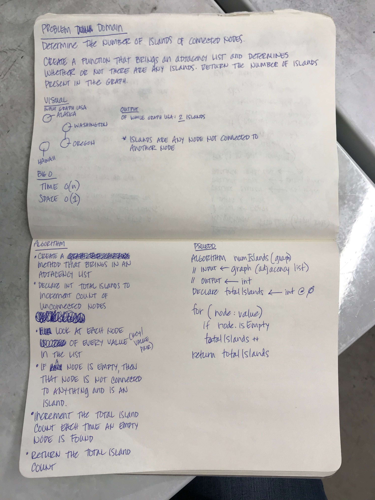

# Graph Challenges

## Challenge 1: Breadth-First Traversal of a Graph 
Implement a breadth-first traversal on a graph. 

Extend your graph object with a method called breadthFirstTraversal that accepts a starting node. Return a collection of nodes in the order they were visited. Display the collection.

Example:

Input
```
Pandora--------------Arendelle
                     /      \
                    /        \
            Metroville ----- Monstropolis
             /     \            /
            /       \          /
           /         \        /
        Narnia----------Naboo
```
Output
```
Pandora, Arendelle, Metroville, Monstropolis, Narnia, Naboo
```

## Solution


## Challenge 2: Find Edges
Given a business trip itinerary, and a route map, is the trip possible with direct flights? If so, how much will the trip cost be?

Write a function which takes in a graph and a starting node. Return the cost of the full trip if it is possible with direct flights.

Example:  

Input 
```
            $150
Pandora ---------------- Arendelle
     \                  /         \
      \ $82        $99 /           \ $42
       \              / $105        \
           Metroville -------- Monstropolis
             /     \            /
        $37 /       \ $26      / $73
           /   $250  \        /
       Narnia --------- Naboo
```
Output
```
[Metroville, Pandora]               True, 82
[Arendelle, Monstropolis, Naboo]    True, $115
[Naboo, Pandora]                    False, $0
[Narnia, Arendelle, Naboo]          False, $0
```

## Solution


## Challenge 3: Find Islands
Determine the number of islands of connected nodes.

Create a function that brings an adjacency list and determines whether or not there are any islands. Return the number of islands present in the graph.

## Solution
